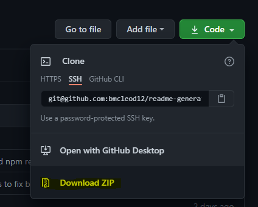

# ReadMe Generator

## Description

This command line application enables you to create a ReadMe file for your GitHub projects without worrying about writing Markdown code.

## Table of Contents

* [Description](#description)
* [Installation](#installation)
* [Usage](#usage)
* [Tests](#tests)
* [License](#license)

## Installation

As this is just a class project, it has not been added for public use in the npm registry, so we will install it the long way - downloading the code via zip file.

Please note these installation instructions assume you already have Visual Studio Code installed, as well as Node.js.

Visual Studio Code: https://code.visualstudio.com/ 

Node.js: https://nodejs.org/en/

1. Click the Code button at the top right of this repository, then click Download ZIP.

2. Open the zip folder location once it completes downloading.

3. Right click on the zip file and select "Extract All..."

4. Browse for the location where you would like to extract the files.

5. After the zip is extracted, right click on the folder and select "Open with Code"

6. In Visual Studio, right click in the parent folder and select "Open in Integrated Terminal."

7. In the Integrated Terminal, enter "npm i" and hit Enter. This will install both fs and inquirer from the npm registry.

8. Upon completion, thre will be a new node_modules folder in your Visual Studio, giving you what you need to run the program.

## Usage

To use the application, with Integrated Terminal still open in your VS Code:

1. Enter "node index.js"

2. A series of questions will be asked, prompting you to provide information for each section of the ReadMe. After answering each question and assuming nothing goes wrong, you will be presented with a message reading, "Successfully created README.md!"

3. The README will be created under output folder and will contain the information provided to the prompts. You can now copy this content/file into your own project for use in GitHub.

## Tests

## License

MIT License

Copyright (c) 2021 KU Coding Bootcamp

Permission is hereby granted, free of charge, to any person obtaining a copy
of this software and associated documentation files (the "Software"), to deal
in the Software without restriction, including without limitation the rights
to use, copy, modify, merge, publish, distribute, sublicense, and/or sell
copies of the Software, and to permit persons to whom the Software is
furnished to do so, subject to the following conditions:

The above copyright notice and this permission notice shall be included in all
copies or substantial portions of the Software.

THE SOFTWARE IS PROVIDED "AS IS", WITHOUT WARRANTY OF ANY KIND, EXPRESS OR
IMPLIED, INCLUDING BUT NOT LIMITED TO THE WARRANTIES OF MERCHANTABILITY,
FITNESS FOR A PARTICULAR PURPOSE AND NONINFRINGEMENT. IN NO EVENT SHALL THE
AUTHORS OR COPYRIGHT HOLDERS BE LIABLE FOR ANY CLAIM, DAMAGES OR OTHER
LIABILITY, WHETHER IN AN ACTION OF CONTRACT, TORT OR OTHERWISE, ARISING FROM,
OUT OF OR IN CONNECTION WITH THE SOFTWARE OR THE USE OR OTHER DEALINGS IN THE
SOFTWARE.